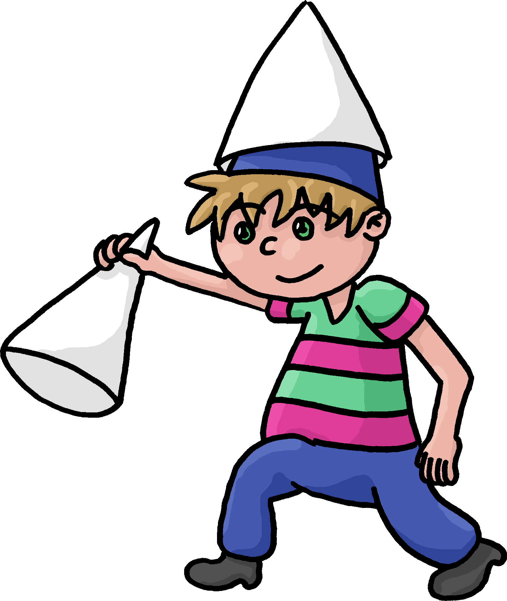
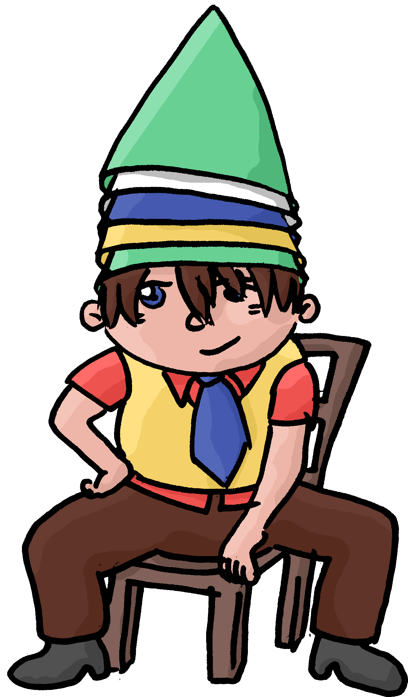

# Catch the Hat

## Description

In "Catch the Hat" players roll the dice clockwise. The youngest player begins. Every Player has 5 hats at the beginning. The goal is to be the last survivor.

## Rules

### Start

Put the colored hats on the according arrows. Now let the youngest player begin. Everyone with no hats outside his arrow is allowed to roll the dice up to 3 times, until he gets a "6". If so, the player in turn moves one of his hats from the arrow to the start field, marked with "A". Then he is allowed to roll the dice again, to move away from the start field.

### Main Game

Roll the dice, move your hat around and try to catch the others. If you hit a field, where another hat is already standing, and it's not yours, you can place your hat on top of it. The top most hat shows the owner of the tower.

### Safe Fields

The green fields are so called safe areas, where no one can catch you. Several players can have hats there at once.

### The prison

In the middle every player has his prison, where he can bring his catched hats. You must roll an exact number to get to your prison. Then leave all other hats there and bring your own hats back to your start arrow.

### Rolling a "6"

If your dice shows a 6 you can either put a new hat on your start field, marked with an "A", or move one of our hats around and roll the dice again. If stepping out on the start field, you must roll the dice again and move away from there.

### Number-fields

If you step on a field with a number written on it ("2", "3" or "4"), move again this number of steps.

### The End

If there is only one player left, he has won.

