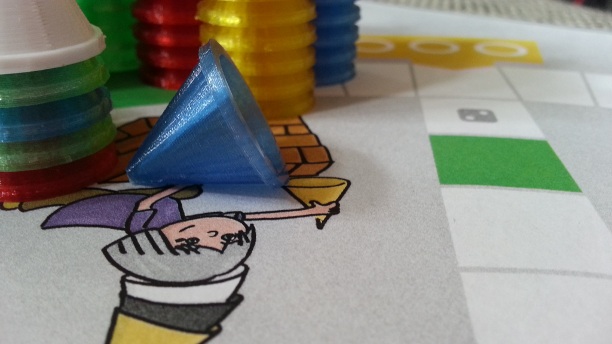

# Hütchenjagd

## Andere Sprachen

[Englisch](./README_-_Catch_the_Hat.md)

## Beschreibung

In "Hütchenjagd" lasst ihr reihum die Würfel rollen um die Hütchen der anderen Spieler einzufangen. 
Der jüngste Spieler beginnt. Jeder Spieler hat zu Beginn 6 Hütchen. Ziel ist es, als Letzter noch auf dem Spielfeld zu stehen.

## Regeln

### Start

Jeder Spieler setzt seine 6 Hütchen auf den gleichfarbigen Bereich am Spielfeldrand. Der jüngste Spieler beginnt.
Jeder, der noch kein Hütchen im Spiel hat, darf den Würfel bis zu drei mal werfen, bis er eine "6" hat. Sobald eine
"6" gewürfelt wurde, darf der Spieler eines seiner Hütchen auf das Startfeld setzen. Dann muss der Würfel erneut geworfen
werden. Befinden sich noch Hütchen auf der Ersatzbank, muss das soeben ins Spiel gebrachte Hütchen vom Startfeld weggezogen
werden.

### Hauptspiel

Wirf den Würfel, bewege dein Hütchen in eine beliebige Richtung und versuche, die Hütchen der anderen Spieler zu fangen!
Endet dein Zug auf einem Feld, auf dem sich bereits das Hütchen eines anderen Spielers befindet, dann setze dein Hütchen
einfach darauf und es gilt als gefangen. Das oberste Hütchen zeigt an, wem der Hütchenturm gehört.

### Bänkchen

Grüne Spielfelder werden Bänkchen genannt. Sitzt ein Hütchen auf einem Bänkchen, dann ist es sicher und kann nicht
eingefangen werden. Es dürfen beliebig viele Hütchen auf einem Bänkchen sitzen.

### Das Gefängnis

In der Mitte des Spielfelds besitzt jeder Spieler sein Gefängnis. Türme können von anderen Spielern eingefangen werden
solang sie im Spiel sind. Deshalb sollte ein Turm schnell ins Gefängnis gebracht werden. Um dein Hütchen ins Gefängnis
zu ziehen, musst du mindestens ein anderes Hütchen gefangen haben. Um das Gefängnis betreten zu können muss dein Zug genau
in der Zelle enden. Alle Fremden Hütchen werden als Gefangene in der Zelle eingesperrt, alle eigenen Hütchen kehren auf die
Ersatzbank am Spielfeldrand zurück und können später wieder mit einer "6" ins Spiel zurückkehren.

### Eine "6" würfeln

Wenn der Würfel eine "6" zeigt, kann entweder ein neues Hütchen ins Spiel gebracht werden, oder (wenn keine Hütchen mehr auf
der Ersatzbank sitzen, oder ein eigenes Hütchen das Starfeld blockiert) ein Hütchen 6 Felder weit gezogen werden. In jedem
Fall darf danach erneut gewürfelt werden. Befindet sich auf dem sechsten Feld ein fremdes Hütchen, so darf es gefangen werden.
Anschließend wird erneut gewürfelt. Mehrere "6"-en führen zu weiteren Würfen.

### Zahlenfelder

Endet ein Zug auf einem Feld mit einem Würfelsymbol, dann verlängert sich der Zug um die gezeigte Augenzahl.

### Das Ende

Der letzte Spieler, der übrig ist, gewinnt.

